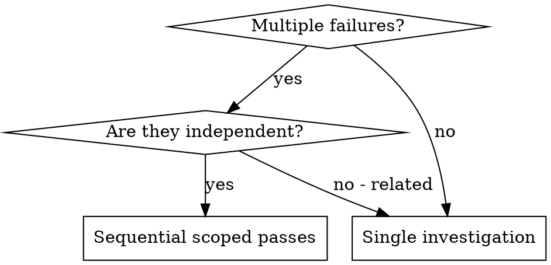

# Dispatching Parallel Agents (Codex Sequential)

## Overview

When you have multiple unrelated failures, a single long investigation creates context bloat and missed details. In Codex, treat each independent domain as its own scoped pass and execute them sequentially.

**Core principle:** One domain per pass, integrate after each.

## When to Use



**Use when:**
- 3+ test files failing with different root causes
- Multiple subsystems broken independently
- Each problem can be understood without full-system context
- Fixes can be applied in isolation

**Don't use when:**
- Failures are related (fixing one likely fixes others)
- You need full system state to reason about behavior
- There is heavy shared state between tasks

## Quick Reference

| Step | Action | Output |
|------|--------|--------|
| Identify domains | Group failures by subsystem | List of scoped passes |
| Execute passes | One domain at a time | Fix + notes |
| Integrate | Review, test, merge changes | Combined, verified state |

## The Pattern

### 1. Identify Independent Domains

Group failures by what is broken:
- File A tests: Tool approval flow
- File B tests: Batch completion behavior
- File C tests: Abort functionality

Each domain is independent; fix one without relying on the others.

### 2. Create Focused Passes

Each pass gets:
- **Specific scope:** One test file or subsystem
- **Clear goal:** Make these tests pass
- **Constraints:** Don't change unrelated code
- **Expected output:** Summary of root cause and changes

### 3. Execute Sequentially

```text
Pass A: Fix agent-tool-abort.test.ts failures
Pass B: Fix batch-completion-behavior.test.ts failures
Pass C: Fix tool-approval-race-conditions.test.ts failures
```

### 4. Review and Integrate

After each pass:
- Review the changes
- Verify tests for that domain
- Integrate before moving to the next pass

## Example Scenario

**Failures:**
- agent-tool-abort.test.ts: 3 failures (timing issues)
- batch-completion-behavior.test.ts: 2 failures (tools not executing)
- tool-approval-race-conditions.test.ts: 1 failure (execution count = 0)

**Passes:**
- Pass A: Replace timeouts with event-based waiting
- Pass B: Fix event structure bug (threadId in wrong place)
- Pass C: Add wait for async tool execution to complete

**Result:** Independent fixes, no conflicts, full suite green.

## Common Mistakes

- Working on multiple domains in the same pass
- Changing unrelated code "while you are there"
- Skipping verification before moving to the next pass

## Common Rationalizations

| Excuse | Reality |
|--------|---------|
| "I'll fix them all together to save time" | Context bleed causes missed details. Scope one pass at a time. |
| "This is small, I can multitask" | Multitasking increases errors. Finish one domain first. |
| "I'll verify at the end" | Early verification prevents compounding mistakes. |

## Red Flags

- You are touching multiple subsystems in one pass
- You cannot state the pass scope in one sentence
- You are skipping tests because "it looks right"

## Key Benefits

1. **Focus** - One domain at a time reduces context switching
2. **Isolation** - Changes are easier to reason about
3. **Accuracy** - Fewer missed details and regressions
4. **Integration safety** - Verify before moving on

## Verification

After each pass:
1. Review the summary and diff
2. Check for conflicts with other domains
3. Run relevant tests
4. Integrate changes before starting the next pass
