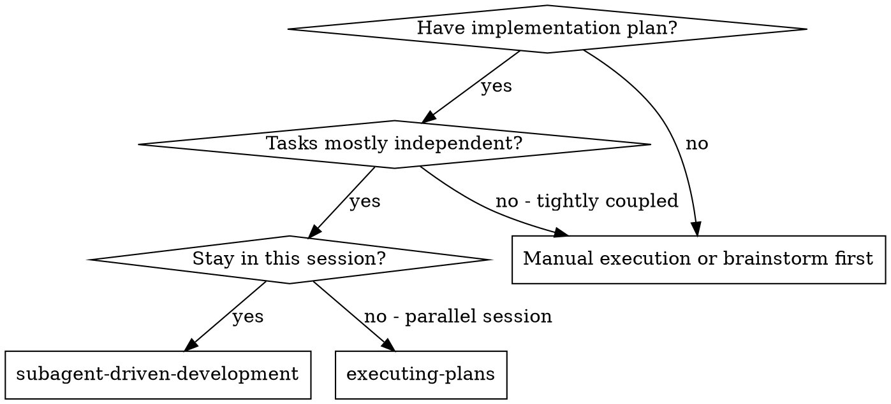
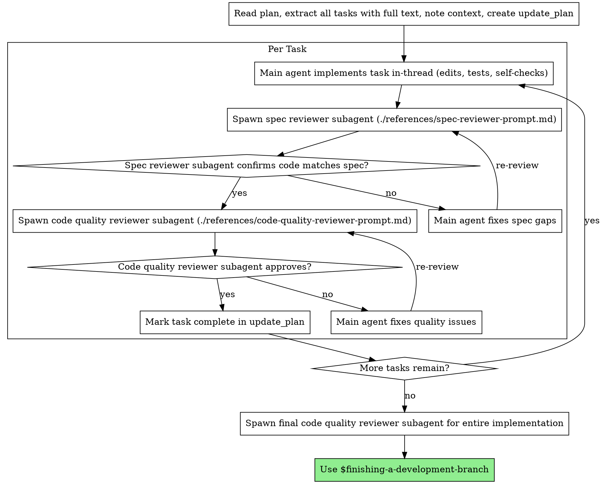

# Subagent-Driven Development

Execute plan by implementing each task in-thread and dispatching fresh reviewer subagents per task, with two-stage review after each: spec compliance review first, then code quality review.

**Core principle:** Main agent implements + reviewer subagents for spec then quality = high quality, fast iteration

**Codex workflow:** Orchestrate reviewer subagents with spawn_agent/wait/send_input using prompts in `./references/`.

## When to Use



**vs. Executing Plans (parallel session):**
- Same session (no context switch)
- Fresh subagent per task (no context pollution)
- Two-stage review after each task: spec compliance first, then code quality
- Faster iteration (no human-in-loop between tasks)

## The Process



## Codex Subagent Tools

- Use `spawn_agent` to dispatch reviewer subagents only (generic agent_type; role defined in prompt).
- Use `wait` to monitor until a subagent finishes.
- Use `send_input` to answer questions or request fixes.
- Close subagents only when their work is complete.

## Prompt Templates

- `./references/spec-reviewer-prompt.md` - Dispatch spec compliance reviewer subagent
- `./references/code-quality-reviewer-prompt.md` - Dispatch code quality reviewer subagent

**Legacy (not used in this workflow):**
- `./references/implementer-prompt.md`

## Quick Reference

| Pass | Goal | Output |
|------|------|--------|
| Main agent | Implement task, tests, commit | Implementation + report |
| Spec compliance reviewer | Validate requirements, no extras | ✅/❌ with file references |
| Code quality reviewer | Review maintainability, tests | Issues list + assessment |
| Final code quality reviewer | Whole-change review | Ready-to-merge check |

## Example Workflow

```
You: I'm using Subagent-Driven Development to execute this plan.

[Read plan file once: docs/plans/feature-plan.md]
[Extract all 5 tasks with full text and context]
[Create update_plan with all tasks]

Task 1: Hook installation script

[Get Task 1 text and context (already extracted)]
[Main agent implements in-thread with full task text + context]

You: "Quick clarification - should the hook be installed at user or system level?"
Partner: "User level (~/.config/superpowers/hooks/)"

You:
  - Implemented install-hook command
  - Added tests, 5/5 passing
  - Self-review: Found I missed --force flag, added it
  - Committed

[Dispatch spec compliance reviewer]
Spec reviewer: ✅ Spec compliant - all requirements met, nothing extra

[Get git SHAs, dispatch code quality reviewer]
Code reviewer: Strengths: Good test coverage, clean. Issues: None. Approved.

[Mark Task 1 complete]

Task 2: Recovery modes

[Get Task 2 text and context (already extracted)]
[Main agent implements in-thread with full task text + context]

You:
  - Added verify/repair modes
  - 8/8 tests passing
  - Self-review: All good
  - Committed

[Dispatch spec compliance reviewer]
Spec reviewer: ❌ Issues:
  - Missing: Progress reporting (spec says "report every 100 items")
  - Extra: Added --json flag (not requested)

[Main agent fixes issues]
You: Removed --json flag, added progress reporting

[Spec reviewer reviews again]
Spec reviewer: ✅ Spec compliant now

[Dispatch code quality reviewer]
Code reviewer: Strengths: Solid. Issues (Important): Magic number (100)

[Main agent fixes]
You: Extracted PROGRESS_INTERVAL constant

[Code reviewer reviews again]
Code reviewer: ✅ Approved

[Mark Task 2 complete]

...

[After all tasks]
[Dispatch final code reviewer]
Final reviewer: All requirements met, ready to merge

Done!
```

## Advantages

**vs. Manual execution:**
- Fresh context per task (no confusion)
- Subagent can ask questions before and during work
- Two-stage review catches spec and quality issues early
- Works entirely in one Codex session

**vs. Executing Plans:**
- Same session (no handoff)
- Continuous progress (no waiting)
- Review checkpoints explicit

**Efficiency gains:**
- No cross-session handoff
- Controller provides full task text (no plan-file reads)
- Issues surfaced before moving on

**Quality gates:**
- Self-review catches issues before handoff
- Two-stage review: spec compliance, then code quality
- Review loops ensure fixes actually work
- Spec compliance prevents over/under-building
- Code quality ensures implementation is well-built

**Cost:**
- More subagent invocations per task
- Controller does more prep work (extracting all tasks upfront)
- Review loops add iterations
- But catches issues early (cheaper than debugging later)

## Common Mistakes

- Skipping spec compliance before code quality review
- Moving to the next task with open review issues
- Starting implementation with unclear requirements
- Dispatching reviewer subagents in parallel instead of sequentially
- Making subagents read the plan file instead of providing full task text

## Common Rationalizations

| Excuse | Reality |
|--------|---------|
| "I'll review after all tasks" | Issues compound. Review after each task prevents rework. |
| "Spec is obvious, no need for spec pass" | Implementation drift is common. Verify against requirements. |
| "Code quality can wait" | Later reviews miss context. Fix now while it's fresh. |
| "It's a tiny change" | Small changes still regress. Review still required. |
| "Reviewers aren't available, I'll just do it myself" | If subagents are required, enable /experimental or pause. Manual fallback changes the workflow. |
| "My self-review is enough" | Reviewers must verify code, not trust reports. |
| "We can skip the reviewer for this one task" | Skipping a single reviewer breaks the quality gate. |

**Violating the letter of the rules is violating the spirit of the rules.**

## Red Flags

**Never:**
- Skip reviews (spec compliance OR code quality)
- Proceed with unfixed issues
- Skip dispatching required reviewer subagents (spec or quality)
- Dispatch reviewer subagents in parallel for the same task (conflicts)
- Start multiple tasks at once (context bleed)
- Make subagents read the plan file (provide full task text instead)
- Skip scene-setting context (you need to know where the task fits)
- Ignore questions or proceed with ambiguity
- Accept "close enough" on spec compliance (spec compliance pass found issues = not done)
- Skip review loops (review pass found issues = main agent fixes = review again)
- Let main-agent self-review replace actual review (both are needed)
- **Start code quality review before spec compliance is ✅** (wrong order)
- Move to next task while either review has open issues

**If you have questions:**
- Answer clearly and completely
- Provide additional context if needed
- Don't rush them into implementation

**If reviewer finds issues:**
- Main agent fixes them
- Reviewer re-checks the fix
- Repeat until approved
- Don't skip the re-review

**If you missed issues after moving on:**
- Return to the task and rerun the review passes

## Integration

**Required workflow skills:**
- **$writing-plans** - Creates the plan this skill executes
- **$requesting-code-review** - Code review template for reviewer subagents
- **$finishing-a-development-branch** - Complete development after all tasks

**Use with:**
- **$test-driven-development** - Follow TDD per task when in scope

**Alternative workflow:**
- **$executing-plans** - Use when you must switch to a separate session
