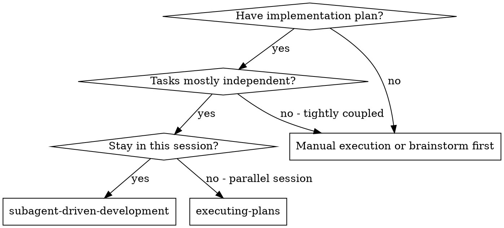
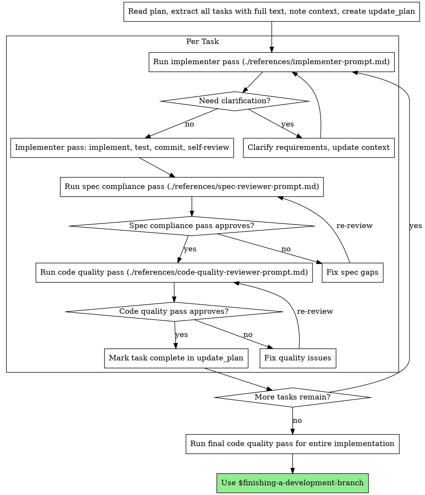

# Subagent-Driven Development

Execute plan sequentially per task with two-stage self-review: spec compliance first, then code quality.

**Core principle:** Sequential implementer pass + two-stage review (spec then quality) = high quality, fast iteration

**Codex workflow:** Use this as a checklist with distinct self-review passes (implementer, spec compliance, code quality).

## When to Use



**vs. Executing Plans (parallel session):**
- Same session (no context switch)
- Sequential task execution with explicit self-review passes
- Two-stage review after each task: spec compliance first, then code quality
- Faster iteration (no session handoff between tasks)

## The Process



## Prompt Templates

- `./references/implementer-prompt.md` - Implementer pass checklist
- `./references/spec-reviewer-prompt.md` - Spec compliance self-review checklist
- `./references/code-quality-reviewer-prompt.md` - Code quality self-review checklist

## Quick Reference

| Pass | Goal | Output |
|------|------|--------|
| Implementer pass | Implement task, tests, commit | Implementation + report |
| Spec compliance pass | Validate requirements, no extras | ✅/❌ with file references |
| Code quality pass | Review maintainability, tests | Issues list + assessment |
| Final quality pass | Whole-change review | Ready-to-merge check |

## Example Workflow

```
You: I'm using Subagent-Driven Development (sequential self-review passes) to execute this plan.

[Read plan file once: docs/plans/feature-plan.md]
[Extract all 5 tasks with full text and context]
[Create update_plan with all tasks]

Task 1: Hook installation script

[Get Task 1 text and context (already extracted)]
[Run implementer pass using the checklist]

Implementer pass: "Before I begin - should the hook be installed at user or system level?"

You: "User level (~/.config/superpowers/hooks/)"

Implementer pass: "Got it. Implementing now..."
[Later] Implementer pass report:
  - Implemented install-hook command
  - Added tests, 5/5 passing
  - Self-review: Found I missed --force flag, added it
  - Committed

[Run spec compliance pass]
Spec compliance pass: ✅ Spec compliant - all requirements met, nothing extra

[Get git SHAs, run code quality pass]
Code quality pass: Strengths: Good test coverage, clean. Issues: None. Approved.

[Mark Task 1 complete]

Task 2: Recovery modes

[Get Task 2 text and context (already extracted)]
[Run implementer pass using the checklist]

Implementer pass: [No questions, proceeds]
Implementer pass report:
  - Added verify/repair modes
  - 8/8 tests passing
  - Self-review: All good
  - Committed

[Run spec compliance pass]
Spec compliance pass: ❌ Issues:
  - Missing: Progress reporting (spec says "report every 100 items")
  - Extra: Added --json flag (not requested)

[Implementer pass fixes issues]
Implementer pass: Removed --json flag, added progress reporting

[Spec compliance pass reviews again]
Spec compliance pass: ✅ Spec compliant now

[Run code quality pass]
Code quality pass: Strengths: Solid. Issues (Important): Magic number (100)

[Implementer pass fixes]
Implementer pass: Extracted PROGRESS_INTERVAL constant

[Code quality pass reviews again]
Code quality pass: ✅ Approved

[Mark Task 2 complete]

...

[After all tasks]
[Run final code quality pass]
Final pass: All requirements met, ready to merge

Done!
```

## Advantages

**vs. Manual execution:**
- Explicit pass separation reduces context drift
- Questions surfaced before work begins
- Two-stage review catches spec and quality issues early
- Works entirely in one Codex session

**vs. Executing Plans:**
- Same session (no handoff)
- Continuous progress (no waiting)
- Review checkpoints explicit

**Efficiency gains:**
- No cross-session handoff
- Full task text captured once per task
- Issues surfaced before moving on

**Quality gates:**
- Self-review catches issues before handoff
- Two-stage review: spec compliance, then code quality
- Review loops ensure fixes actually work
- Spec compliance prevents over/under-building
- Code quality ensures implementation is well-built

**Cost:**
- More review passes per task
- Controller does more prep work (extracting all tasks upfront)
- Review loops add iterations
- But catches issues early (cheaper than debugging later)

## Common Mistakes

- Skipping spec compliance before code quality review
- Moving to the next task with open review issues
- Starting implementation with unclear requirements

## Common Rationalizations

| Excuse | Reality |
|--------|---------|
| "I'll review after all tasks" | Issues compound. Review after each task prevents rework. |
| "Spec is obvious, no need for spec pass" | Implementation drift is common. Verify against requirements. |
| "Code quality can wait" | Later reviews miss context. Fix now while it's fresh. |
| "It's a tiny change" | Small changes still regress. Review still required. |

## Red Flags

**Never:**
- Skip reviews (spec compliance OR code quality)
- Proceed with unfixed issues
- Start multiple tasks at once (context bleed)
- Skip pasting full task text into your working context
- Skip scene-setting context (you need to know where the task fits)
- Ignore questions or proceed with ambiguity
- Accept "close enough" on spec compliance (spec compliance pass found issues = not done)
- Skip review loops (review pass found issues = implementer fixes = review again)
- Let implementer self-review replace actual review (both are needed)
- **Start code quality review before spec compliance is ✅** (wrong order)
- Move to next task while either review has open issues

**If you have questions:**
- Answer clearly and completely
- Provide additional context if needed
- Don't rush them into implementation

**If reviewer finds issues:**
- Implementer pass fixes them
- Review pass repeats
- Repeat until approved
- Don't skip the re-review

**If you missed issues after moving on:**
- Return to the task and rerun the review passes

## Integration

**Required workflow skills:**
- **$writing-plans** - Creates the plan this skill executes
- **$requesting-code-review** - Code review template for self-review passes
- **$finishing-a-development-branch** - Complete development after all tasks

**Use with:**
- **$test-driven-development** - Follow TDD per task when in scope

**Alternative workflow:**
- **$executing-plans** - Use when you must switch to a separate session
